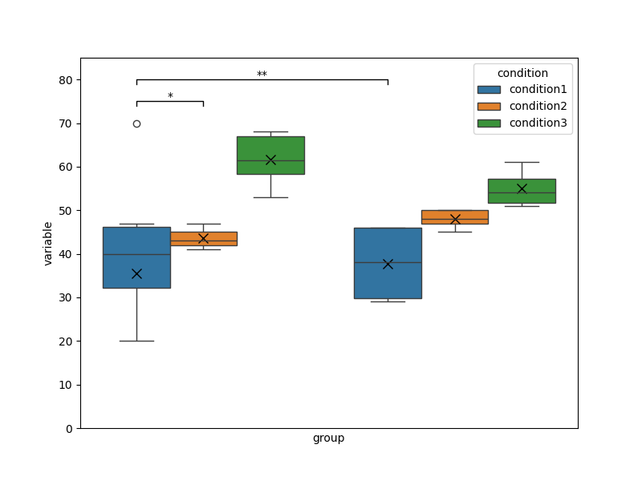
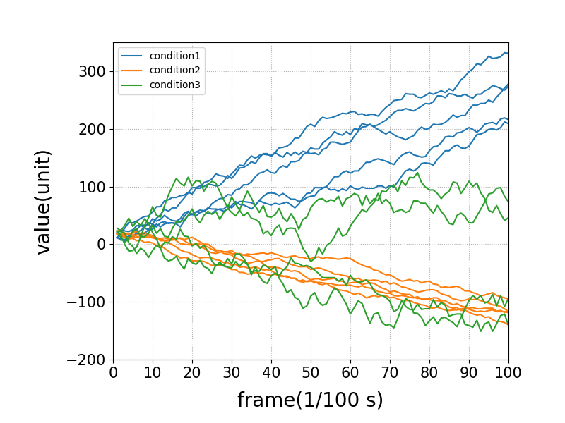

# DataVisualize

以下はver1.0.0の内容 (v2.0.0の内容への変更対応中)

## 概要

* 規程形式の入力データをグラフ(箱ひげ図or線グラフ)化する
* (option) データの概要を出力する

<details open>

<summary>生成グラフ例</summary>





</details>

## 環境 (動作確認済み)

* Python 3.12.2
    * WindowsでPythonランチャーを使用していることを前提としている
        * それ以外の場合pyコマンドを適宜pythonコマンド等に置き換えること
    * ライブラリはrequirements.txtを参照
* PowerShell 7.4.6

## How to use

### 準備

1. このリポジトリをクローンする
1. init.ps1を実行する

```powershell
./init.ps1
```

### 実行

1. visualize/Input/に指示ファイル，データファイルを配置する(詳細は以下)
1. templateをコピーしてconfig.ymlに名前を変更し，編集する
1. venv環境下でgen_graph.pyを実行する (以下はPowerShellの場合)

```powershell
./venv/Scripts/Activate.ps1
py src/gen_graph.py     # または python src/gen_graph.py
```

## ファイル構成

```plaintext
DataVisualize/
```

## 入力

* 以下の通り1つの指示ファイルと1つ以上のデータファイル，config.ymlを用意する

### 指示ファイル

Input/にinstructions.csvを配置し，以下の通り記述する．
なお2列目以降は例であるため，実際のデータに合わせて変更すること．
**指示ファイルの形式が間違っている場合のエラー処理等は実装していないので注意**

```csv

output_name, filename, is_time_series, xlim_min, xlim_max, ylim_min, ylim_max, xlabel, ylabel, legend, brackets, bracket_base_y
output1, data1.csv, TRUE, 0, 100, -10, 200, frame, parameter1,condition1:con1.condition2:con2.condition3:con3, [1:1][1:2]*.[1:1][2:1]**, 70
output2, data2.csv, FALSE,,,20, 50, condition, parameter2,True:continue.False:stop.:PGT,,

```

このとき各列の指定方法は以下の通り

1. output_name: 出力ファイル名(**必須**，拡張子なし，png形式等で出力，ディレクトリ指定可能)
1. filename: データファイル名(**必須**，拡張子あり，csv形式，visualize/Input/をルートとした相対パスで指定)
1. is_time_series: 時系列データかどうか(TRUE/FALSE，"TRUE"以外の文字列が入力された場合はFALSEとして扱われる)
1. xlim_min: x軸の最小値
    * minとmaxが同時に指定されていない場合は適用されない(以下min, max系は同様)
1. xlim_max: x軸の最大値
1. ylim_min: y軸の最小値
1. ylim_max: y軸の最大値
    * bracket_base_yよりも大きい値を指定することを推奨
1. xlabel: x軸のラベル，$$で囲むことでLaTex数式記法使用可能 (**必須**)
1. ylabel: y軸のラベル，$$で囲むことでLaTex数式記法使用可能 (**必須**)
1. legend: 入力csvの列名と凡例の対応表(コロンで対応，ピリオドで区切り)
    * 例: Trueをcontinue，Falseをstop，空文字をPGTというラベルにしたい場合: True:continue.False:stop.:PGT
    * **注意**: データファイルの列名でTRUE/FALSEを使用している場合，True/Falseとして認識されるので注意
        * Bool型で読み取られた後に文字列に変換されるため
    * **注意**: 変換前のcondition名すべてに対応した凡例を指定する必要がある
    * **注意**: 凡例中にピリオドを含む場合には対応していない
1. brackets: 有意差の対応表(ピリオド区切りで複数指定可能)
    * 指定した順に下から追加される
    * 有意差を示すブラケットの形式は`[group_id:condition_id][group_id:condition_id]mark`のように指定する
        * ここで各要素の意味は以下の通り
            * group_id: groupの番号(数字，1始まり)
            * condition_id: conditionの番号(数字，1始まり)
            * mark: ブラケット上部に表示する文字
        * このように指定すると，1つ目の[]で指定した条件と2つ目の[]で指定した条件の間に有意差を示すブラケットが表示される
    * 例: `[1:1][1:2]*.[1:1][2:1]**` は以下の通り
        1. `[1:1][1:2]*` : 1つ目のgroupの1番目のconditionと1つ目のgroupの2番目のconditionの間に`*`で有意差ブラケットを表示
        1. `[1:1][2:1]**` : 1つ目のgroupの1番目のconditionと2つ目のgroupの1番目のconditionの間に`**`で有意差ブラケットを表示
1. bracket_base_y: 箱ひげ図の有意差を示す線の最低y座標
    * データの最大値より大きい値を指定することを推奨

exampleファイル，brackets系は[参考画像](docs/img/single_ex_description.png)も参照のこと

### データファイル

#### 試行ごとに単発のパラメータとして出力されるもの

* 形式: csv
    * 1列目: 自由
    * 2列目: 値
    * 3列目: 条件
        * 3列の条件別に箱ひげ図として出力される
        * 条件名は指示ファイルのlegendで指定したものに対応させる
    * 4列目: グループ
        * 4列のグループ別に箱ひげ図として出力される [参考画像](docs/img/single_ex_description.png)

```csv
id, value, condition, group
1, 10, TRUE, group1
2, 20, TRUE, group1
3, 30, TRUE, group2
4, 40, TRUE, group2
5, 50, FALSE, group1
6, 60, FALSE, group1
7, 70, FALSE, group2
8, 80, FALSE, group2
9, 90, TRUE, group1
10, 100, TRUE, group1

```

#### 試行ごとに時系列データとして出力されるもの

例: 歩行時の関節角度

* 形式: csv
    * 1列目: frame(フレーム番号)
    * 2列目以降: 値
        * 2列目以降のヘッダ毎に平均を実線，標準偏差を網掛けでプロットしたグラフが出力される
        * ヘッダ名は指示ファイルのlegendで指定したものに対応させることで凡例を変更可能

```csv
frame, condition1, condition1, condition2, condition2
1, 10, 20, 30, 40
2, 20, 30, 40, 50
3, 30, 40, 50, 60
4, 40, 50, 60, 70
5, 50, 60, 70, 80
```

### config.yml

* グラフ出力等に関する設定を記述する
* visualize/に配置する
* 詳細はconfig.yml-templateや参考画像を参照

<details>
<summary>設定参考画像</summary>


</details>

## 出力

* Output/にグラフが出力される
* config.ymlでグラフ出力に関する設定を変更可能

* v2.0.0時点でlegendの変更が行えない
