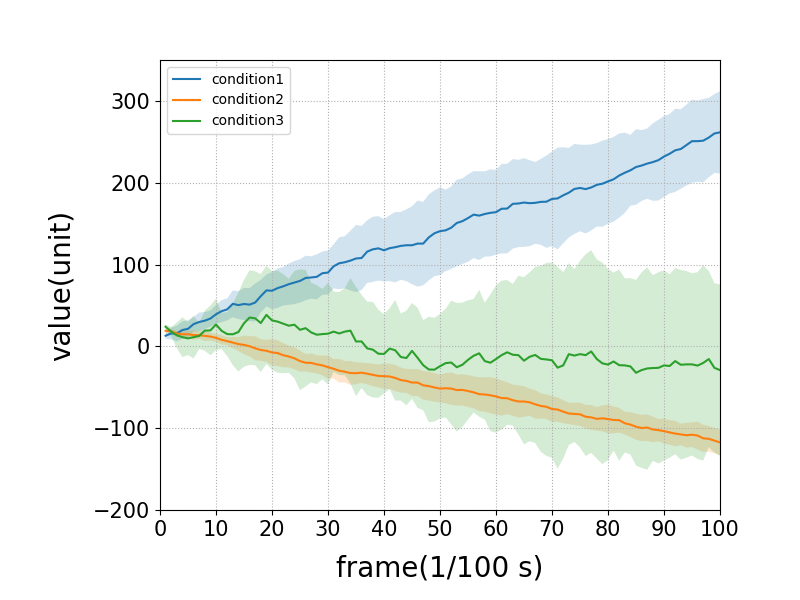

# DataVisualize

以下はver1.0.0の内容 (v2.0.0の内容への変更対応中)

## 概要

* 規程形式の入力データをグラフ(箱ひげ図or線グラフ)化する
* (option) データの概要を出力する

生成グラフ例

// TODO: 画像の変更(箱ひげ図: グループ化がわかるもの，時系列グラフ: 個別のものの追加)



## 環境 (動作確認済み)

* Python 3.12.2
    * ライブラリはrequirements.txtを参照

## How to use

### 準備

// TODO: 環境構築スクリプトの追加

1. このリポジトリをクローンする
1. 以下のコマンドを実行し，必要なライブラリをインストールする

```bash
pip install -r requirements.txt
```

### 実行

// TODO: 実行方法の変更

1. visualize/Input/に指示ファイル，データファイルを配置する(詳細は以下)
1. templateをコピーしてconfig.ymlに名前を変更し，編集する
1. 以下のコマンドを実行する

```bash
python src/gen_graph.py
```

## ファイル構成

// TODO: ファイル構成の変更

```plaintext
DataVisualize/
│  .gitignore
│  config.yml
│  config.yml-template
│  README.md
│  requestments.txt
├─docs
├─Inputs-example
│      instructions-example.csv
│      single-example.csv
│      time_seriese-example.csv
├─Inputs
├─Outputs
└─src
      gen_graph.py
      graph.py

```

## 入力

* 以下の通り1つの指示ファイルと1つ以上のデータファイル，config.ymlを用意する

### 指示ファイル

// TODO: 指示ファイルの形式変更(examplesを参考に)

Input/にinstructions.csvを配置し，以下の通り記述する．
なお2列目以降は例であり，実際には必要な列数だけ記述する．
**指示ファイルの形式が間違っている場合のエラー処理等は実装していないので注意**

```csv

output_name, filename, is_time_series, xlim_min, xlim_max, ylim_min, ylim_max, xlabel, ylabel, legend, brackets, bracket_base_y
output1, data1.csv, TRUE, 0, 100, -10, 200, frame, parameter1,True:continue.False:stop, 1:2:*.1:3:**, 70
output2, data2.csv, FALSE,,,20, 50, condition, parameter2,True:continue.False:stop.:PGT,,

```

このとき各列の指定方法は以下の通り

1. output_name: 出力ファイル名(**必須**，拡張子なし，png形式で出力)
1. filename: データファイル名(**必須**，拡張子あり，csv形式，visualize/Input/をルートとした相対パスで指定)
1. is_time_series: 時系列データかどうか(TRUE/FALSE，"TRUE"以外の文字列が入力された場合はFALSEとして扱われる)
1. xlim_min: x軸の最小値
    * minとmaxが同時に指定されていない場合は適用されない(以下min, max系は同様)
1. xlim_max: x軸の最大値
1. ylim_min: y軸の最小値
1. ylim_max: y軸の最大値
    * bracket_base_yよりも大きい値を指定することを推奨
1. xlabel: x軸のラベル，$$で囲むことでLaTex数式記法使用可能 (**必須**)
1. ylabel: y軸のラベル，$$で囲むことでLaTex数式記法使用可能 (**必須**)
1. legend: 入力csvの列名と凡例の対応表(コロンで対応，ピリオドで区切り)
    * 例: Trueをcontinue，Falseをstop，空文字をPGTというラベルにしたい場合: True:continue.False:stop.:PGT
    * **注意**: データファイルの列名でTRUE/FALSEを使用している場合，True/Falseとして認識されるので注意
1. brackets: 有意差の対応表(コロンで対応，ピリオドで区切り)
    * 指定した順に下から追加される
    * 数字は左から順に1, 2, 3...と対応
    * ※例中のバックスラッシュは実際には不要(mdのエスケープ文字)
    * 例: 1と2の間に\*の有意差を示す場合: 1:2:\*
    * 例: 1と2の間に\*，2と3の間に\*\*の有意差を示す場合: 1:2:\*.2:3:\*\*
1. bracket_base_y: 箱ひげ図の有意差を示す線の最低y座標
    * データの最大値より大きい値を指定することを推奨

exampleファイル，brackets系は[参考画像](docs/brackets.png)も参照のこと

### データファイル

#### 試行ごとに単発のパラメータとして出力されるもの

// TODO: group列の追加，group列の効果を示す例(画像)の追加

例: 歩行終了距離

* 形式: csv
    * 1列目: 自由
    * 2列目: 値
    * 3列目: 条件
        * 3列の条件別に箱ひげ図として出力される
        * 条件名は指示ファイルのlegendで指定したものに対応させる

```csv
id, value, condition
1, 10, TRUE
2, 20, TRUE
3, 30, TRUE
4, 40, TRUE
5, 50, FALSE
6, 60, FALSE
7, 70, FALSE
8, 80, FALSE
9, 90, TRUE
10, 100, TRUE

```

#### 試行ごとに時系列データとして出力されるもの

例: 歩行時の関節角度

* 形式: csv
    * 1列目: frame(フレーム番号)
    * 2列目以降: 値
        * 2列目以降のヘッダ毎に平均を実線，標準偏差を網掛けでプロットしたグラフが出力される
        * ヘッダ名は指示ファイルのlegendで指定したものに対応させることで凡例を変更可能

```csv
frame, condition1, condition1, condition2, condition2
1, 10, 20, 30, 40
2, 20, 30, 40, 50
3, 30, 40, 50, 60
4, 40, 50, 60, 70
5, 50, 60, 70, 80
```

### config.yml

// TODO: 配置位置の変更，説明画像の変更

* グラフ出力等に関する設定を記述する
* visualize/に配置する
* 詳細はconfig.yml-templateや参考画像を参照
    * [フォント](docs/fonts.png)
    * [位置](docs/locs.png)

## 出力

* Output/にグラフが出力される
* config.ymlでグラフ出力に関する設定を変更可能
